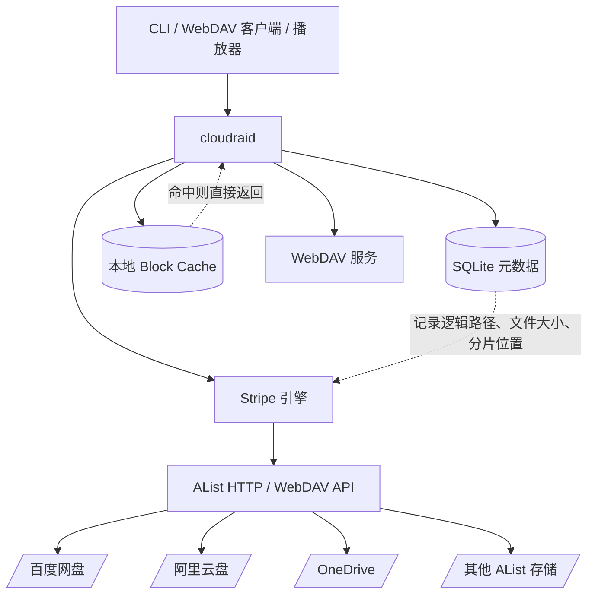
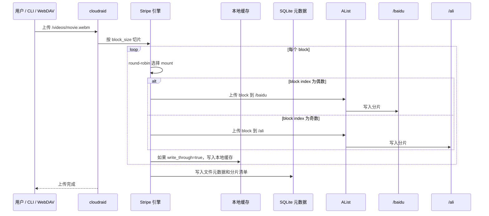
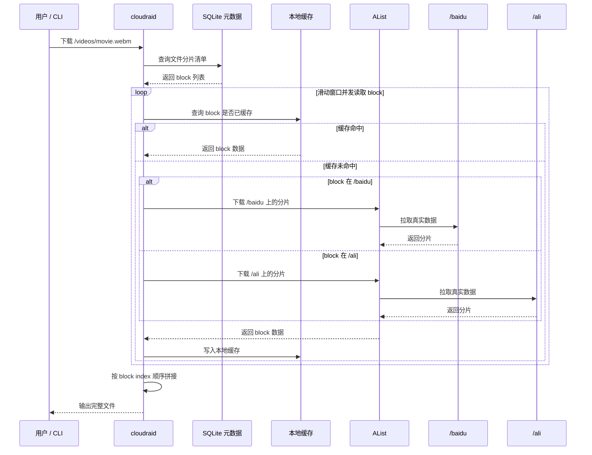
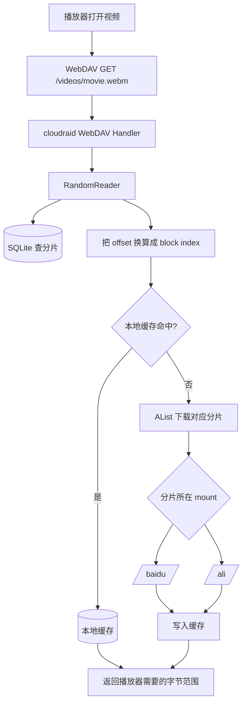

# ☁️ cloudraid

> 把多个网盘拼成一个“云上 RAID 0”，让大文件上传、下载和播放都能多路并行。

cloudraid 是一个基于 AList 的多网盘分片网关。它会把一个文件切成多个数据块，按顺序分散写入多个 AList 存储；读取时再从多个网盘并行拉取分片并拼回原始文件。

简单说：

```text
一个大文件 → 切成很多块 → 分散到多个网盘 → 读取时并行拉回来
```

适合这些场景：

- 🚀 想把多个网盘的带宽叠加起来
- 🎬 想通过 WebDAV 直接播放 cloudraid 里的视频
- 🧩 想把百度网盘、阿里云盘、OneDrive 等 AList 存储聚合成一个逻辑空间
- 🧪 想测试真实网盘在分片上传、并行下载、随机读场景下的表现

> 注意：cloudraid 当前是 RAID 0 模型，没有冗余、没有纠删码。任何一个底层网盘缺失分片，相关文件就可能无法完整读取。它追求的是速度，不是容灾。

## ✨ 项目做了什么

用户看到的是一个普通文件系统：

```text
/videos/movie.webm
/documents/archive.zip
```

但实际在底层，cloudraid 会把文件拆成这样：

```text
/baidu/cloudraid/<file-id>.b00000
/ali/cloudraid/<file-id>.b00001
/baidu/cloudraid/<file-id>.b00002
/ali/cloudraid/<file-id>.b00003
...
```

你不需要手动管理这些分片。cloudraid 负责：

- 切片
- 分发
- 上传
- 下载
- 拼接
- 缓存
- WebDAV 暴露
- 元数据管理

## 🏗️ 架构设计



核心组件：

| 模块 | 作用 |
|---|---|
| CLI | 提供 `put`、`get`、`ls`、`rm`、`serve` 命令 |
| WebDAV | 让 Finder、资源管理器、播放器可以像访问普通网盘一样访问 cloudraid |
| Stripe 引擎 | 负责切片、分配、并发上传、并发下载 |
| SQLite 元数据 | 记录逻辑文件和真实分片之间的映射关系 |
| 本地缓存 | 缓存最近写入或读取过的 block，加速重复访问 |
| AList 客户端 | 通过 AList 统一访问百度网盘、阿里云盘等存储 |

## ⬆️ 上传流程



上传时，cloudraid 做的是：

1. 读取本地文件。
2. 按 `stripe.block_size` 切成多个 block。
3. 按 `alist.mounts` 的顺序 round-robin 分配：
   - block 0 → 第一个 mount
   - block 1 → 第二个 mount
   - block 2 → 第一个 mount
   - block 3 → 第二个 mount
4. 用 `stripe.write_workers` 控制并发上传。
5. 写入 SQLite 元数据。
6. 可选写入本地缓存。

## ⬇️ 下载流程



下载时的关键点：

- 只有通过 cloudraid 上传的文件才能被 cloudraid 并行下载。
- cloudraid 不会自动把 AList 里已有的普通文件变成分片文件。
- 下载并发由 `stripe.read_workers` 控制。
- 本地缓存命中时，不会访问真实网盘。

## 🎬 WebDAV 播放视频流程

通过 WebDAV 挂载后，播放器看到的是一个普通文件。但播放器通常不会一次性读取完整视频，而是会先读文件头、文件尾，然后根据播放进度不断 seek。



这也是为什么 `block_size` 很重要：

- block 小：seek 更精准，少拉无用数据，但分片多、API 开销高。
- block 大：分片少，上传和顺序下载更友好，但 seek 时可能多拉一些数据。

## 🛠️ 安装与编译

### 1. 准备 AList

cloudraid 依赖 AList 访问真实网盘。你可以使用已经运行的 AList，也可以让 cloudraid 自动拉起一个本地 AList 进程。

如果使用本项目旁边的 AList 源码：

```bash
cd ../alist
go build -o alist .
```

### 2. 编译 cloudraid

```bash
go build -o cloudraid ./cmd/cloudraid
```

## ⚙️ 配置

复制示例配置：

```bash
mkdir -p data
cp examples/config.yaml data/config.yaml
```

示例配置：

```yaml
data_dir: "./data"

alist:
  binary_path: "../alist/alist"
  work_dir:    "./data/alist"
  address:     "http://127.0.0.1:5244"
  admin_user:  "admin"
  admin_password: "please-change-me"
  subdir: "cloudraid"
  mounts:
    - "/baidu"
    - "/ali"

stripe:
  block_size:    4194304
  write_workers: 4
  read_workers:  4

cache:
  dir:       "./data/cache"
  max_bytes: 2147483648
  write_through: true

webdav:
  listen:   "0.0.0.0:5260"
  username: "cloudraid"
  password: "please-change-me"
```

### 配置项说明

| 配置 | 说明 |
|---|---|
| `data_dir` | cloudraid 的运行数据目录，SQLite 元数据默认放在这里。 |
| `alist.binary_path` | AList 可执行文件路径。 |
| `alist.work_dir` | AList 的工作目录。 |
| `alist.address` | AList HTTP 地址。cloudraid 会先探测该地址，已有服务则复用。 |
| `alist.admin_user` | AList 管理员用户名。 |
| `alist.admin_password` | AList 管理员密码。不要提交到 Git。 |
| `alist.subdir` | cloudraid 在每个 AList mount 下存放分片的子目录。 |
| `alist.mounts` | 参与分片的 AList 挂载路径。至少需要一个。 |
| `stripe.block_size` | 每个分片大小，单位 bytes。真实网盘大文件建议从 4 MiB 或 8 MiB 开始测试。 |
| `stripe.write_workers` | 上传分片并发数。 |
| `stripe.read_workers` | 下载分片并发数。 |
| `cache.dir` | 本地 block 缓存目录。 |
| `cache.max_bytes` | 本地缓存最大容量。 |
| `cache.write_through` | 上传时是否同步写入本地缓存。 |
| `webdav.listen` | WebDAV 监听地址。局域网访问可使用 `0.0.0.0:5260`。 |
| `webdav.username` | WebDAV Basic Auth 用户名。 |
| `webdav.password` | WebDAV Basic Auth 密码。 |

## 🚀 使用方法

所有命令都通过 `-config` 指定配置文件：

```bash
./cloudraid -config data/config.yaml <command>
```

### 启动 WebDAV 服务

```bash
./cloudraid -config data/config.yaml serve
```

如果 `webdav.listen` 配置为 `0.0.0.0:5260`，局域网内其他机器可以访问：

```text
http://<cloudraid 所在机器的局域网 IP>:5260/
```

使用 `webdav.username` 和 `webdav.password` 登录。

### 挂载 WebDAV

下面假设 cloudraid 服务地址是：

```text
http://192.168.1.10:5260/
```

请把 `192.168.1.10` 换成运行 cloudraid 的机器在局域网内的 IP。

#### macOS

Finder 原生支持 WebDAV：

1. 打开 Finder。
2. 菜单栏选择 `前往` → `连接服务器...`。
3. 输入：

   ```text
   http://192.168.1.10:5260/
   ```

4. 点击连接。
5. 输入 `webdav.username` 和 `webdav.password`。
6. 挂载成功后，可以像访问普通磁盘一样浏览、上传、播放文件。

也可以用命令行挂载：

```bash
mkdir -p ~/Mounts/cloudraid
mount_webdav http://192.168.1.10:5260/ ~/Mounts/cloudraid
```

#### Windows

Windows 可以通过“映射网络驱动器”挂载：

1. 打开文件资源管理器。
2. 右键 `此电脑` → `映射网络驱动器...`。
3. 选择一个盘符。
4. 文件夹填写：

   ```text
   http://192.168.1.10:5260/
   ```

5. 勾选 `使用其他凭据连接`。
6. 输入 `webdav.username` 和 `webdav.password`。

如果 Windows 拒绝连接 HTTP WebDAV，可能需要启用 WebClient 服务，或允许 Basic Auth over HTTP。更推荐在不可信网络中使用 HTTPS 反向代理后再挂载。

#### Linux

Linux 常用 `davfs2` 挂载 WebDAV。

Debian / Ubuntu：

```bash
sudo apt install davfs2
mkdir -p ~/cloudraid
sudo mount -t davfs http://192.168.1.10:5260/ ~/cloudraid
```

Fedora：

```bash
sudo dnf install davfs2
mkdir -p ~/cloudraid
sudo mount -t davfs http://192.168.1.10:5260/ ~/cloudraid
```

Arch Linux：

```bash
sudo pacman -S davfs2
mkdir -p ~/cloudraid
sudo mount -t davfs http://192.168.1.10:5260/ ~/cloudraid
```

挂载时输入 `webdav.username` 和 `webdav.password` 即可。

如果只是临时访问，也可以用支持 WebDAV 的文件管理器，例如 GNOME Files、Dolphin、Thunar，地址通常写成：

```text
dav://192.168.1.10:5260/
```

### 上传文件

```bash
./cloudraid -config data/config.yaml put /path/to/local.mp4 /videos/local.mp4
```

上传后，用户看到的是 `/videos/local.mp4` 这个逻辑文件；真实数据会被切成多个 block 写入多个 AList mount。

### 下载文件

```bash
./cloudraid -config data/config.yaml get /videos/local.mp4 /tmp/local.mp4
```

下载时会根据元数据并行读取底层分片，并按顺序拼回本地文件。

### 列出文件

```bash
./cloudraid -config data/config.yaml ls /
./cloudraid -config data/config.yaml ls /videos
```

### 删除文件

```bash
./cloudraid -config data/config.yaml rm /videos/local.mp4
```

删除会移除 cloudraid 元数据，并按分片清单删除底层 AList 存储中的 block 文件。

## 🎛️ 参数怎么选

### block_size

`stripe.block_size` 是最影响体验的参数之一。

| block_size | 适合场景 | 说明 |
|---:|---|---|
| 1 MiB | 调试、随机读验证 | seek 粒度细，但大文件会产生大量小文件，上传 API 开销明显。 |
| 4 MiB | 通用起点 | 上传、下载、seek 之间比较平衡。 |
| 8 MiB | 大文件传输 | 分片数更少，上传更友好，视频播放通常仍可接受。 |
| 16 MiB+ | 顺序传输优先 | API 开销低，但随机读可能多拉较多无用数据。 |

### workers

- `write_workers` 控制同时上传多少个 block。
- `read_workers` 控制同时下载多少个 block。
- 并发不是越大越好，太高可能触发网盘限流、直链过期或 AList 压力增大。

建议：

- 两个网盘：先从 `2` 或 `4` 开始。
- 三到四个网盘：可以测试 `4`、`6`、`8`。
- 如果出现 403、超时、下载中断，先降低并发。

## ❓ 常见问题

### cloudraid 能加速 AList 里已经存在的普通文件吗？

不能。

cloudraid 只能并行读取自己上传并登记在 SQLite 元数据库里的文件。AList 中已经存在的 `/baidu/movie.mp4` 只是一个普通文件，cloudraid 不知道它应该如何拆分，也无法并行读取它的不同分片。

### 为什么删除缓存后播放会变慢？

因为缓存命中时，cloudraid 直接从本地磁盘返回 block；缓存未命中时，需要从真实网盘重新拉取分片。

### 为什么上传可能比单盘更慢？

如果 block 很小，一个大文件会变成很多小文件。例如 463 MiB 文件在 1 MiB block 下会产生 464 个分片。大量小文件上传会带来明显的 AList 和网盘 API 开销。

可以尝试：

- 把 `block_size` 调大到 4 MiB 或 8 MiB
- 适当提高 `write_workers`
- 分别测试不同网盘组合

### 这是备份工具吗？

不是。

当前 cloudraid 没有冗余。它更像是“速度优先”的 RAID 0。重要文件请保留单独备份。

## ⚠️ 注意事项

- `data/config.yaml` 通常包含密码、token 或本地路径，不要提交到 Git。
- `data/` 下的 SQLite、缓存、AList 工作目录都是运行时数据，不应提交。
- 做真实下载性能测试前，应清空 `cache.dir`，否则可能测到的是本地缓存速度。
- 使用真实网盘时，下载速度可能受网盘限速、账号类型、直链策略、AList 驱动实现影响。
- 局域网访问 WebDAV 时，如果无法连接，检查 `webdav.listen`、macOS 防火墙和机器 IP。

## 📊 基准测试

真实网盘测试记录见 [BENCHMARK.md](./BENCHMARK.md)。

当前观察到的趋势：

- cloudraid 可以提升多网盘下载采样速度。
- 小 block 会显著增加上传 API 开销。
- 后续值得重点测试不同 `block_size` 与 worker 数组合。

## 📜 License

cloudraid 使用 GNU Affero General Public License v3.0（AGPL-3.0）开源协议发布，详见 [LICENSE](./LICENSE)。
